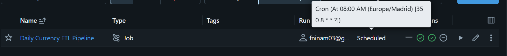
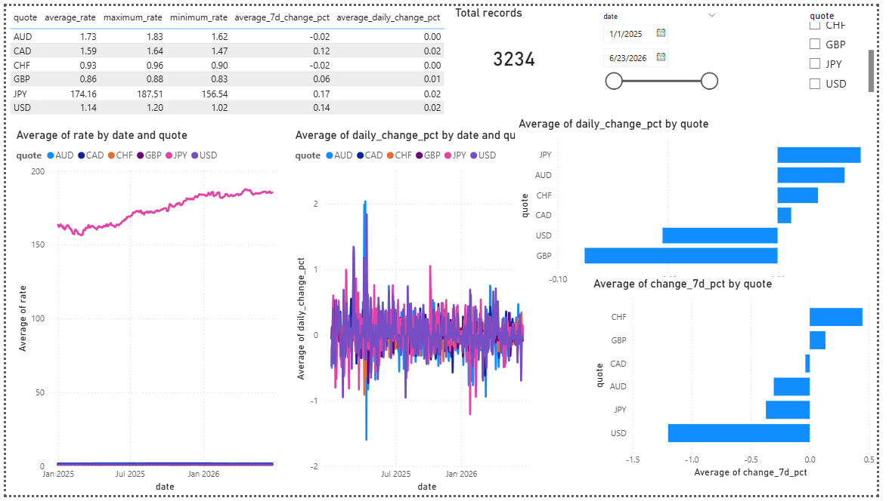

# currency-exchange-etl
End-to-end currency exchange rate ETL pipeline using Databricks, PostgreSQL, Power BI, and the Frankfurter API.
# Currency Exchange Rate ETL Pipeline

## Project Overview

This project demonstrates a complete end-to-end ETL pipeline for collecting, transforming, storing, analysing, and visualising historical currency exchange-rate data.

The pipeline extracts exchange-rate data from the Frankfurter public API, processes the data in Databricks using Python and PySpark, stores the final analytical datasets in PostgreSQL, and presents the results through an interactive Power BI dashboard.

The project was developed as an individual Business Intelligence final assignment.

---

## Business Case

International companies frequently receive revenue, make payments, or purchase goods in multiple currencies. Exchange-rate movements can therefore affect costs, revenues, budgeting, and financial planning.

The purpose of this project is to create an automated solution that monitors exchange rates against the euro and allows users to:

* analyse historical exchange-rate trends;
* compare daily currency movements;
* identify short-term increases and decreases;
* monitor the latest available exchange rates;
* support data-driven financial decisions.

The following currencies are included:

* Australian Dollar — AUD
* Canadian Dollar — CAD
* Swiss Franc — CHF
* British Pound — GBP
* Japanese Yen — JPY
* United States Dollar — USD

The euro is used as the base currency.

---

## Solution Architecture


```text
Frankfurter Public API
          |
          v
Databricks Python / PySpark Notebook
          |
          v
Bronze Delta Table
Raw API data
          |
          v
Silver Delta Table
Cleaned and validated data
          |
          v
Gold Delta Tables
Calculated KPIs and analytical datasets
          |
          v
Neon PostgreSQL Database
Relational storage of final Gold datasets
          |
          v
Power BI Dashboard
Interactive visualisation and analysis
          |
          v
GitHub
Code, documentation, screenshots, and project files
```

---

## Technology Stack

| Component                         | Technology                    |
| --------------------------------- | ----------------------------- |
| Data source                       | Frankfurter API               |
| Data processing                   | Python and PySpark            |
| ETL platform                      | Databricks                    |
| Databricks storage                | Delta Lake tables             |
| Database                          | PostgreSQL hosted on Neon     |
| Workflow automation               | Databricks Jobs and Workflows |
| Visualisation                     | Microsoft Power BI            |
| Version control and documentation | GitHub                        |

---

## Data Source

The project uses the Frankfurter public API.

Main endpoint:

```text
https://api.frankfurter.dev/v2/rates
```

Historical request used in the project:

```text
https://api.frankfurter.dev/v2/rates?from=2025-01-01&base=EUR&quotes=USD,GBP,CHF,JPY,CAD,AUD
```

The endpoint returns:

* date;
* base currency;
* quote currency;
* exchange rate.

No API key is required.

---

## ETL Pipeline

## 1. Extract

Python sends an HTTP request to the Frankfurter API using the `requests` library.

The API response is returned in JSON format and converted into a Spark DataFrame.

The historical dataset begins on 1 January 2025 and is updated with the latest available exchange-rate data.

---

## 2. Bronze Layer

The Bronze layer preserves the original data extracted from the API.

Databricks table:

```text
bronze_exchange_rates
```

Columns:

| Column | Description        |
| ------ | ------------------ |
| base   | Base currency      |
| date   | Exchange-rate date |
| quote  | Target currency    |
| rate   | Exchange rate      |

The Bronze table represents the raw source data before cleaning and transformation.

---

## 3. Silver Layer

The Silver layer contains the cleaned and validated data.

Databricks table:

```text
silver_exchange_rates
```

Cleaning and preparation steps include:

* converting the date column from text to a proper date type;
* adding an extraction timestamp;
* checking for missing values;
* checking for duplicate records;
* removing duplicates using date, base currency, and quote currency as the business key;
* validating the number of records for every currency.

The data-quality checks confirmed:

* no missing values;
* no duplicate currency records;
* equal record counts for all six currencies.

---

## 4. Gold Layer

The Gold layer contains analytical data prepared for reporting and dashboarding.

### Gold analytical table

```text
gold_currency_analysis
```

Additional calculated fields:

| Field            | Description                                           |
| ---------------- | ----------------------------------------------------- |
| previous_rate    | Previous available exchange rate                      |
| daily_change_pct | Percentage change from the previous available record  |
| rate_7_days_ago  | Exchange rate seven records earlier                   |
| change_7d_pct    | Percentage change compared with seven records earlier |

### Currency summary table

```text
gold_currency_summary
```

Contains one summary row per currency, including:

* average exchange rate;
* minimum exchange rate;
* maximum exchange rate;
* average daily percentage change;
* average seven-day percentage change.

### Latest exchange rates table

```text
gold_latest_exchange_rates
```

Contains the most recent available observation for each currency.

### Daily movers table

```text
gold_daily_movers
```

Ranks currencies by their latest daily percentage movement.

---

## PostgreSQL Storage

The final Gold datasets are loaded into a Neon PostgreSQL database.

PostgreSQL tables:

```text
gold_currency_analysis
gold_currency_summary
gold_latest_exchange_rates
gold_daily_movers
```

The main PostgreSQL table was validated after loading.

Final validation results:

```text
Total PostgreSQL rows: 3234
Unique PostgreSQL records: 3234
Duplicate PostgreSQL rows: 0
```

The PostgreSQL table contains 539 dates and six currencies:

```text
539 dates × 6 currencies = 3234 rows
```

Database credentials are not included in this repository.

---

## Workflow Orchestration

The pipeline is automated using a Databricks Job.

Job name:

```text
Daily Currency ETL Pipeline
```

Task name:

```text
run_currency_etl
```

The job:

* executes the complete Databricks notebook;
* calls the API;
* refreshes the Bronze, Silver, and Gold tables;
* loads the final Gold tables into PostgreSQL;
* runs automatically every day at 08:00.

A manual test run completed successfully before scheduling.



---

## Power BI Dashboard

Power BI connects to the PostgreSQL Gold tables.

The dashboard includes:

* historical exchange-rate trend chart;
* daily percentage-movement chart;
* latest daily movers chart;
* latest seven-day movers chart;
* total-records card;
* date-range slicer;
* currency slicer;
* currency summary table.



### Dashboard interpretation

The actual exchange-rate chart shows the historical value of each currency against the euro.

JPY has a much larger numerical scale than the other currencies, which causes the other lines to appear compressed. For that reason, the daily percentage-change chart is also included because it provides a more comparable view of currency volatility.

Positive percentage values indicate an increase in the quote currency rate against the euro, while negative values indicate a decrease.

---

## Data Quality Checks

The following data-quality controls are implemented:

* HTTP status-code validation;
* missing-value checks;
* duplicate-record checks;
* date-type conversion;
* numeric exchange-rate validation;
* equal record-count validation by currency;
* PostgreSQL row-count validation;
* PostgreSQL duplicate validation;
* successful scheduled job execution.

---

## Repository Files

```text
currency-exchange-etl/
|
|-- 01_currency_etl_pipeline_GitHub.py
|-- 01_currency_etl_pipeline_GitHub.html
|-- Currency_Exchange_Rate_Dashboard.pbix
|-- databricks_job_schedule.png
|-- powerbi_dashboard.png
|-- README.md
|-- .gitignore
```

### File descriptions

| File                                    | Description                                       |
| --------------------------------------- | ------------------------------------------------- |
| `01_currency_etl_pipeline_GitHub.py`    | Exported Databricks notebook source code          |
| `01_currency_etl_pipeline_GitHub.html`  | Rendered notebook with code and outputs           |
| `Currency_Exchange_Rate_Dashboard.pbix` | Power BI dashboard file                           |
| `databricks_job_schedule.png`           | Proof of job scheduling and successful automation |
| `powerbi_dashboard.png`                 | Screenshot of the final dashboard                 |
| `README.md`                             | Complete project documentation                    |

---

## How to Run the Project

### 1. Clone the repository

```bash
git clone https://github.com/fninam03-dot/currency-exchange-etl.git
```

### 2. Import the notebook into Databricks

Upload:

```text
01_currency_etl_pipeline_GitHub.py
```

to a Databricks workspace.

### 3. Configure PostgreSQL credentials

Replace the placeholder values with valid PostgreSQL credentials:

```python
postgres_host = "YOUR_POSTGRES_HOST"
postgres_database = "YOUR_DATABASE_NAME"
postgres_user = "YOUR_USERNAME"
postgres_password = "YOUR_PASSWORD"
```

Credentials should be stored securely and should never be committed to GitHub.

### 4. Run the notebook

Run all notebook cells to:

* extract the API data;
* create Bronze, Silver, and Gold tables;
* load Gold tables into PostgreSQL;
* validate the results.

### 5. Open the Power BI file

Open:

```text
Currency_Exchange_Rate_Dashboard.pbix
```

Update the PostgreSQL connection credentials if necessary and refresh the data.

---

## Security

Sensitive credentials are excluded from this repository.

The following information must never be committed:

* PostgreSQL passwords;
* complete PostgreSQL connection strings;
* Databricks personal access tokens;
* private API keys;
* authentication secrets.

Placeholder values are used in the public notebook.

---

## Challenges and Solutions

### Serverless JDBC limitation

The generic Spark JDBC writer was not supported by Databricks Serverless compute.

The issue was resolved by using the Databricks serverless PostgreSQL connector:

```python
.format("postgresql")
```

### Currency scale differences

JPY exchange rates are numerically much larger than GBP, CHF, USD, CAD, and AUD.

To avoid misleading comparisons, the dashboard includes percentage-change charts in addition to the actual-rate chart.

### Secure credential management

Real PostgreSQL credentials were removed from the GitHub version of the notebook and replaced with placeholders.

### Duplicate prevention

Records are uniquely identified using:

```text
date + base currency + quote currency
```

Duplicate checks are performed before loading analytical datasets.

---

## Limitations

* The project analyses only six quote currencies.
* The euro is the only base currency.
* The seven-day comparison uses seven available records rather than exactly seven calendar days.
* Historical data begins on 1 January 2025.
* The free PostgreSQL hosting plan may have usage limits.
* Power BI refresh requires valid database credentials.

---

## Future Improvements

Possible future improvements include:

* additional currencies;
* multiple base currencies;
* currency-conversion calculations;
* anomaly detection;
* exchange-rate forecasting;
* email alerts for large currency movements;
* data-quality failure notifications;
* secure credential management using Databricks Secrets;
* Power BI Service publishing;
* Docker containerisation;
* automated testing;
* a machine-learning forecasting model.

---

## Project Outcome

The project successfully demonstrates a complete Business Intelligence workflow:

```text
API extraction
→ Data cleaning
→ Delta Lake storage
→ PostgreSQL database storage
→ Workflow automation
→ Power BI visualisation
→ GitHub documentation
```

The pipeline is reproducible, automated, validated, and suitable for an end-to-end ETL demonstration.
